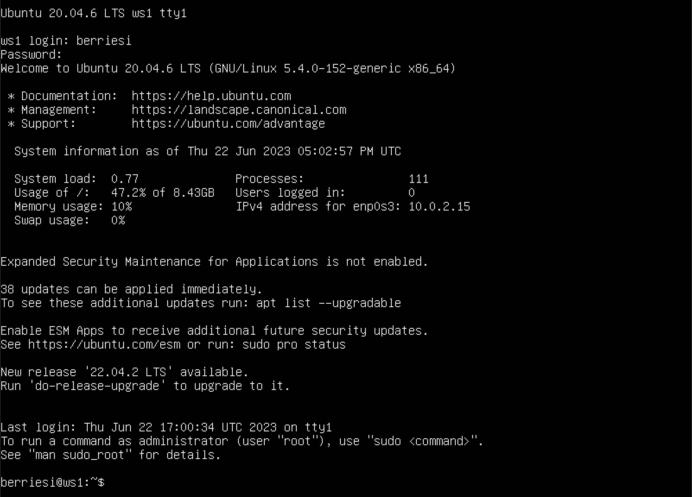
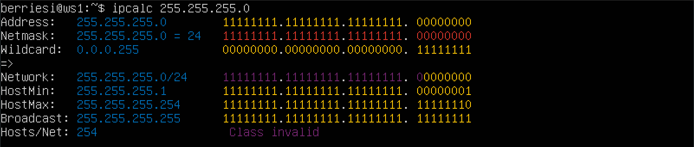
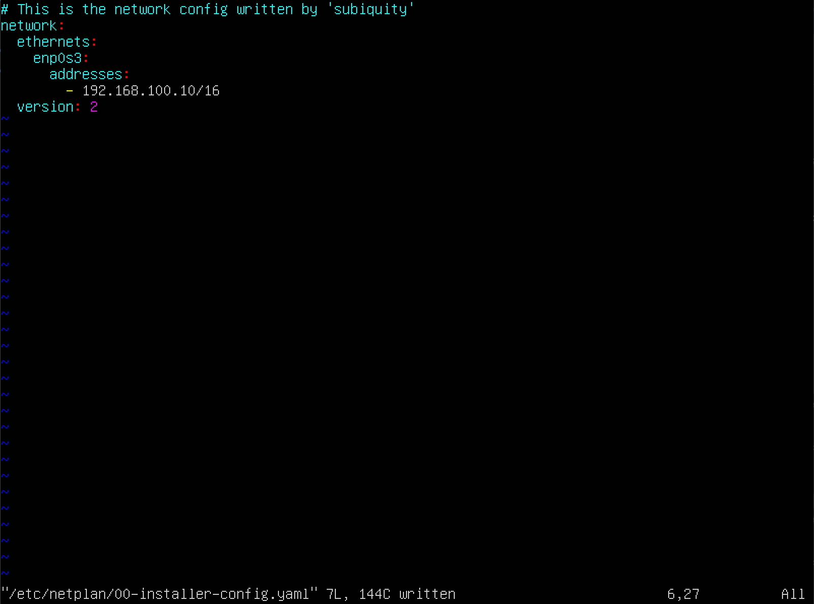
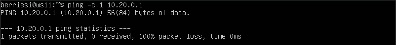

# Report

## **Part 1. ipcalc tool**
- ***Start a virtual machine (hereafter -- ws1)***
  - 

  

- ***1.1 Networks and Masks***
    - network address of 192.167.38.54/13
      - 
        > `192.167.38.54`
    - conversion of the mask 255.255.255.0 to prefix and binary, /15 to normal and binary, 11111111.11111111.11111111.11110000 to normal and prefix
      - 
        > `prefix is /24` `binary is 11111111.11111111.11111111. 000000000`
      - 
        > `normal is 255.254.0.0` `binary is 11111111.11111110.00000000. 00000000`
      - 11111111.11111111.11111111.11110000
        > `normal is 255.255.255.240` `prefix is /28`
    - minimum and maximum host in 12.167.38.4 network with masks: /8, 11111111.11111111.00000000.00000000, 255.255.254.0 and /4
      - 
        > `/8: min is 12.0.0.1, max is 12.255.255.254` `/4: min is 0.0.0.1, max is 15.255.255.254`
      - 
        > `11111111.11111111.00000000.00000000: min is 12.167.0.1, max is 12.167.255.254` `255.255.254.0: min is 12.167.38.1, max is 12.167.39.254`

  

- ***1.2 localhost***
    - Define and write in the report whether an application running on localhost can be accessed with the following IPs: 194.34.23.100, 127.0.0.2, 127.1.0.1, 128.0.0.1
      - `localhost is 127.*.*.* -> only 127.0.0.2 and 127.1.0.1 is accessible` 

  

- ***1.3 Network ranges and segments***
    - which of the listed IPs can be used as public and which only as private: 10.0.0.45, 134.43.0.2, 192.168.4.2, 172.20.250.4, 172.0.2.1, 192.172.0.1, 172.68.0.2, 172.16.255.255, 10.10.10.10, 192.169.168.1
      - `public : 134.43.0.2, 172.0.2.1, 192.172.0.1, 192.169.168.1`
      - `private: 10.0.0.45, 10.10.10.10, 192.168.4.2, 172.20.250.4, 172.68.0.2, 172.16.255.255`
    - which of the listed gateway IP addresses are possible for 10.10.0.0/18 network: 10.0.0.1, 10.10.0.2, 10.10.10.10, 10.10.100.1, 10.10.1.255
      - `10.10.0.2, 10.10.10.10, 10.10.100.1, 10.10.1.255`

  

## **Part 2. Static routing between two machines**
- ***Start two virtual machines (hereafter -- ws1 and ws2)***
  - 

  

- ***View existing network interfaces with the ip a command***
  - ws1
    - 
  - ws2
    - 

  

- ***Describe the network interface corresponding to the internal network on both machines and set the following addresses and masks: ws1 - 192.168.100.10, mask \*/16 \*, ws2 - 172.24.116.8, mask /12***
  - ws1
    - 
  - ws2
    - 

  

- ***Run the netplan apply command to restart the network service***
  - ws1
    - 
  - ws2
    - 

  

- ***2.1 Adding a static route manually***
  - ws1
    - 
    -     
  - ws2
    - 
    - 

  

- ***2.2 Adding a static route with saving***
  - ws1
    - 
    -     
  - ws2
    - 
    - 

  

## **Part 3. iperf3 utility**
- ***3.1 Connection speed***
  - `8 Mbps is 1 MB/s`
  - `100 MB/s is 800000 Kbps`
  - `1 Gbps is 1000 Mbps`

  

- ***3.2 iperf3 utility***
  - 
  - 
  - `connection speed is 3.25 Gbits/sec`

  

## **Part 4. Network firewall**
- ***4.1 iptables utility***
  - ws1
    - 
    - 
  - ws2
    - 
    - 
  - `strategy difference: first is to DROP connection, second is to ACCEPT` 

  

- ***4.2 nmap utility***
  - 

  

## **Part 5. Static network routing**
- ***Start five virtual machines (3 workstations (ws11, ws21, ws22) and 2 routers (r1, r2))***
  - 

  

- ***5.1 Configuration of machine addresses***
  - ws11
    - 
    - 
  - ws21
    - 
    - 
  - ws22
    - 
    - 
  - r1
    - 
    - 
  - r2
    - 
    - 
  - ping ws22 from ws21
    - 
  - ping r1 from ws11
    - 

  

- ***5.2 Enabling IP forwarding***
  - r1
    - 
    - 
    - 
  - r2
    - 
    - 
    - 

  

- ***5.3 Default route configuration***
  - ws11
    - 
    - 
  - ws21
    - 
    - 
  - ws22
    - 
    - 
  - ping r2 from ws11
    - 
    - 

  

- ***5.4 Adding static routes***
  - r1
    - 
    - 
  - r2
    - 
    - 
  - ws11
    - 
    - `for 10.10.0.0/18 had been selected different route for blocking packet transition to the other addresses going to 0.0.0.0/0`

  

- ***5.5 Making a router list***
  - r1
    - 
  - ws11
    - 
  - `traceroute using UDP packets, it sends TTL=1 packet and checks address of the gate, next it sends TTL=2, TTL=3... until it reach the end. Every time it sends 3 packets and measures time for each one, when traceroute gets error reaching a port it stops`

  

- ***5.6 Using ICMP protocol in routing***
  - r1
    - 
  - ws11
    - 

  

## **Part 6. Dynamic IP configuration using DHCP**
  - ***6.1 specify the default router address, DNS-server and internal network address***
    - 

    

  - ***6.2***
    - 
      > *write nameserver 8.8.8.8. in a resolv.conf file*
    - 
    - 
    - 
      > *Specify MAC address at ws11 by adding to etc/netplan/00-installer-config.yaml*
    - 
    - 
      > *Сonfigure r1 the same way as r2*
    - 
    - 
    - 
    - 
      > *Request ip address update from ws21*
    - `we erased old IP with dhclient -r, then got new one with dhclient`

  

## **Part 7. NAT**
  - 
    > *change the line Listen 80 to Listen 0.0.0.0:80on ws22*
  - 
    > *change the line Listen 80 to Listen 0.0.0.0:80on r1*
  - 
    > *start apache on ws22*
  - 
    > *start apache on r1*

    

  - ***7.1-7.3***
    - 
      > *delete rules in the filter table - iptables -F delete rules in the "NAT" table - iptables -F -t nat drop all routed packets - iptables --policy FORWARD DROP*
    - 
    - 
      > *Check connection between ws22 and r1 with the ping command*
  
    

  - ***7.4 allow routing of all ICMP protocol packets***
    - 
    - 
    - 

    

  - ***7.5-7.6***
    - 
    - 
    - 
    - 

    

## **Part 8. Introduction to SSH Tunnels**
  - 
    > *starting firewall*
  - 
    > *starting apache server with Listen localhost:80*
  - 
    > *local TCP forwarding*
  - 
    > *remote TCP forwarding*

    